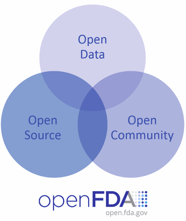

# Notebooks

## Setup

- R
- Packages
- IDE
- Projects
- Sessions
- Git/Github
- RSC
- Shiny

## IDE PICK A DATASET

- Built-in datasets
- data()
- data(ToothGrowth)
- ?ToothGrowth
- ToothGrowth
- View(ToothGrowth)
- summary(ToothGrowth)
- plot(ToothGrowth)

## IDE LET’S EXPLORE...
- getwd()
- library(tidyverse)
- let us explore the data set a bit
- names(ToothGrowth) # names of the variables
- dim(ToothGrowth) # dimension (number of rows and columns)
- str(ToothGrowth) # structure of the data set
- class(ToothGrowth)
- head(ToothGrowth, n = 5)
- tail(ToothGrowth, n = 5)
- ToothGrowth%>% write_csv('ToothGrowth.csv')
- ToothGrowth2 <-read_csv("ToothGrowth.csv")

# R Markdown

## Notes on Reproducibility

- https://www.nih.gov/research-training/rigor-reproducibility/principles-guidelines-reporting-preclinical-research
- http://journals.plos.org/plosbiology/article?id=10.1371%2Fjournal.pbio.1002165
- https://ropensci.org/blog/2014/06/09/reproducibility/
- https://www.r-statistics.com/2016/07/the-reproducibility-crisis-in-science-and-prospects-for-r/
- http://biorxiv.org/content/early/2016/07/29/066803
- https://github.com/statwonk/openfda-dashboard
- https://github.com/crtahlin/medplot
- https://beta.rstudioconnect.com/content/3145/Resources_Links_on_Using_R_in_Regulated_Clinical_Trial_Environments.html

## Live R Markdown Pharma Examples

- [Cancer prediction using caret by JESUS M. CASTAGNETTO
 ](https://rpubs.com/jesuscastagnetto/caret-knn-cancer-prediction)
- [TCGA prostate cancer differential expression by race
by Levi Waldron
](https://rpubs.com/lwaldron/TCGA_prad)
- [GLMM with various R packages
by Kazuki Yoshida
](https://rpubs.com/kaz_yos/glmm1)
- [A not so short review on 
survival analysis in R](http://rpubs.com/alecri/258589)
- [Access to Hospital Care Dashboard](http://colorado.rstudio.com/rsc/content/154/)
- [Comparative Protein Structure Analysis with Bio3D](http://rpubs.com/xqyao/bio3d_pca)
- [Survival Analysis Example](https://rpubs.com/mjeagle/Surv)

 

## R Markdown - Benefits & Features

 - Markdown is a particular type of markup language.
 - Markup languages are designed produce documents from plain text.
 - Existing R code can be used within R Markdown & reports can be parameterized
 - Easy creation of dynamic documents, presentations, and reports
 - Framework for writing reproducible reports from R
 

   
 

## What can I do with RMD?

- Write a book http://adv-r.had.co.nz/
- Write a blog https://rviews.rstudio.com
- Create a website http://rmarkdown.rstudio.com/
- Add a vignette to a package http://yihui.name/knitr/demo/vignette/
- Publish research https://github.com/rstudio/rticles
- Automate reporting https://github.com/philbowsher/Job-Scheduling-R-Markdown-Reports-via-R
- Preserve your sanity and look back at your workflow
- Create a Notebook

## Using R Markdown - How to Build a Document - Installation & Structure

 - Comes installed with the RStudio IDE
 - File Template - within RStudio
 - ["Add R code - Code Chunks"](http://rmarkdown.rstudio.com/authoring_rcodechunks.html) 
 - 
 - ["R Markdown Cheat Sheet"](http://shiny.rstudio.com/articles/rm-cheatsheet.html) 
 - Enhance with Shiny functions and R code
 - Utilize Chunk Options - echo=FALSE, results="hide", include=FALSE, warning=FALSE & message=FALSE 
 - Global chunk options
 
## Example R Markdown Doc -- `Example.RMD`

- Create a new R Markdown document in the IDE by going to 'File' and select 'New File' and select 'R Markdown...' and create a new document and leave output as HTML

</a> 

- Then select Knit and save it as Example.RMD </td>
<td></td>
</tr>
</table>

## rmarkdown::render -- `1_RMD_Stocks`

- rmarkdown::render(“Stocks.Rmd”, params = list(symbol=‘IBM’))
- https://beta.rstudioconnect.com/content/3132/Job_Scheduling_R_Markdown_Reports_via_R.html

## OpenFDA Analysis - R Markdown Report Demo - pharmarmd.Rmd

- [ropenhealth/openfda](https://github.com/rOpenHealth/openfda)
- [openFDA API endpoint for adverse drug events](https://open.fda.gov/drug/event/)
- [openfda-dashboard information](https://github.com/statwonk/openfda-dashboard/blob/master/about2.Rmd)
- [openFDA reference guide](https://open.fda.gov/drug/event/reference/)
- [Ten things to know about drug adverse events](https://open.fda.gov/update/ten-things-to-know-about-adverse-events/)

# The Evolution of R Markdown

## Intro to RMD - flexdashboard - Publish Data Visualizations as a Dashboard

- [flexdashboard](http://rmarkdown.rstudio.com/flexdashboard/)
- [Gene Expression Biclustering - Bryan Lewis](https://jjallaire.shinyapps.io/shiny-biclust/)
- [Iris K-Means Clustering](https://jjallaire.shinyapps.io/shiny-kmeans/)

## Interactive-Reporting-Dashboards

- [Interactive-Reporting-Dashboards-in-Shiny](https://github.com/philbowsher/Interactive-Reporting-Dashboards-in-Shiny)
- [Interactive plots](http://shiny.rstudio.com/gallery/)
- [1_Shiny_Basic_Plots](http://shiny.rstudio.com/gallery/plot-interaction-exclude.html)

## flexdashboard Examples

- 3_RMD_Flex_ToothGrowth
 
## R Markdown Websites

 - [Site](http://rmarkdown.rstudio.com/rmarkdown_websites.html)
 - http://rmarkdown.rstudio.com/flexdashboard/
 
## Blogdown

 - Create websites using R Markdown and Hugo
 - [Site](https://bookdown.org/yihui/blogdown/installation.html)
 - https://rviews.rstudio.com/
 
## Bookdown

 - https://bookdown.org/yihui/bookdown
 - http://docs.rstudio.com/ide/server-pro/
 - https://beta.rstudioconnect.com/content/3060/Word_Up_Gotta_Get_Up_To_Get_Bookdown.html
 
## learnr

- https://rstudio.github.io/learnr/

# Genius of R Markdown...

## Part 2.0 - R Notebooks

- [Notebooks](http://rmarkdown.rstudio.com/r_notebooks.html)
- [Notebook Background](https://rviews.rstudio.com/2017/03/15/why-i-love-r-notebooks/)
- Leonardo da Vinci…Page from the Codex Atlanticus shows notes and images about water wheels and Archimedean Screws
- Combine in a single document: Narrative, Code, Output & then Render to HTML

## Part 2.0 - R Notebooks cont.

- Number 3: Notebooks are for doing science
- Number 2: R Notebooks have great features
- Number 1: R Notebooks make it easy to create and share reports
- http://r4ds.had.co.nz/r-markdown-workflow.html
- 3_RMD_Notebook_Tidyverse

## Further reading

- http://rmarkdown.rstudio.com/lesson-10.html
- https://github.com/rstudio/rstudio-conf/tree/master/2017/R_Notebook_Workflows-Jonathan_McPherson
- https://cdn.rawgit.com/rstudio/rstudio-conf/0b4766c6/2017/R_Notebook_Workflows-Jonathan_McPherson/r-notebook-workflows.html
- https://stackoverflow.com/questions/43820483/difference-between-r-markdown-and-r-notebook

## Further reading cont.

- http://environmentalcomputing.net/using-rstudio-notebooks/
- https://www.rstudio.com/resources/webinars/the-tidyverse-and-rstudio-connect/
- https://www.rstudio.com/resources/webinars/introducing-notebooks-with-r-markdown/
- https://www.rstudio.com/resources/videos/r-notebook-workflows/
